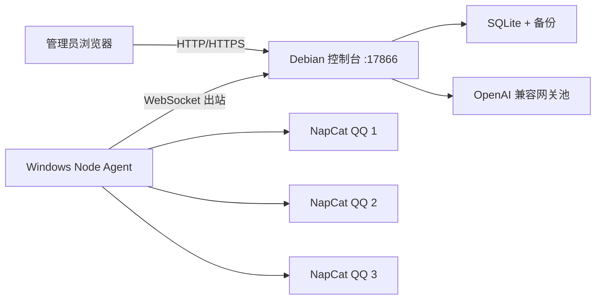

# 泡芙 QQ 机器人平台

轻量级多机器人控制平台。海外 Debian 运行管理后台、授权和 AI 网关故障切换；国内 Windows Server 运行 NapCat 与 Node Agent。初始适合 3 个机器人，后续通过增加 Windows 节点扩展到约 50 个机器人。

## 已实现

- 邮箱 + 密码的单一全局管理员后台，带签名 Session、CSRF 和登录密码修改。
- 多 Windows 节点、多 NapCat/QQ 机器人，后台查看在线状态、二维码和远程重启。
- `机器人 + QQ群` 授权，支持手工授权、套餐、期限、月配额和一次性激活卡密。
- 全局管理员 QQ 白名单，即使不是群主或群管理员也可执行授权操作。
- AI 闲聊、图片理解、技术答疑、生图、独立会话记忆和图文上下文自动参与；无需艾特即可根据群聊停顿自然接话，并可继续追问近期图片。
- 自定义静态回复，支持全局/指定机器人/指定群范围、三种匹配方式和消息变量，不消耗 AI 额度。
- 全能型机器人统一人格；每群冷场 30 分钟主动起话题，连续两次无人回应后沉寂，真人发言后自动恢复。
- 多个 OpenAI 兼容网关，自定义地址、Key、模型、优先级和超时；自动能力识别，群聊短回复 6 秒快速超时并切换备用网关，技术长回答保留独立超时。
- 文本、图片、昵称和拆条上下文审核，支持记录、撤回、撤回并禁言。
- AI 出站关键词/正则过滤，避免密钥和提示词泄露。
- SQLite，无 Redis/邮局/支付依赖；全站累计调用与 Token 独立汇总，明细保留 7 天、审核证据保留 30 天，并自动轮换 7 份备份。
- Agent 仅主动连接海外控制台，国内 Windows 无需开放入站端口。
- Windows Agent 由持续守护脚本托管；NapCat 可安装端口看门狗，进程或 OneBot 端口异常后自动拉起。

## 架构



## 目录

```text
apps/control   Fastify 控制面、授权、审核、AI 路由
apps/web       React 管理台
apps/agent     Windows 多机器人 Agent
packages/shared  OneBot 与控制协议
scripts/windows  Agent 安装、启动、状态、卸载脚本
data           SQLite、备份和运行数据（部署后生成）
```

## 一、海外 Debian 部署控制台

### 1. 安装 Docker

以 `root` 执行：

```bash
apt update
apt install -y ca-certificates curl gnupg git openssl
install -m 0755 -d /etc/apt/keyrings
curl -fsSL https://download.docker.com/linux/debian/gpg -o /etc/apt/keyrings/docker.asc
chmod a+r /etc/apt/keyrings/docker.asc
. /etc/os-release
echo "deb [arch=$(dpkg --print-architecture) signed-by=/etc/apt/keyrings/docker.asc] https://download.docker.com/linux/debian $VERSION_CODENAME stable" > /etc/apt/sources.list.d/docker.list
apt update
apt install -y docker-ce docker-ce-cli containerd.io docker-buildx-plugin docker-compose-plugin
systemctl enable --now docker
```

### 2. 上传源码并生成配置

把本目录完整上传到 `/opt/puff`，然后执行：

```bash
cd /opt/puff
cp .env.production.example .env.production
SESSION_SECRET=$(openssl rand -hex 32)
MASTER_KEY=$(openssl rand -hex 32)
sed -i "s#replace-with-at-least-32-random-characters$#$SESSION_SECRET#" .env.production
sed -i "s#replace-with-at-least-32-random-characters-and-never-change-it#$MASTER_KEY#" .env.production
nano .env.production
```

至少修改：

```dotenv
PUBLIC_URL=http://海外服务器IP:17866
ADMIN_EMAIL=你的登录邮箱
ADMIN_PASSWORD=首次登录密码（至少 10 位）
```

`MASTER_KEY` 用于加密 AI Key，部署后不要更换，否则已保存的网关 Key 无法解密。

### 3. 启动

```bash
cd /opt/puff
docker compose up -d --build
docker compose ps
docker compose logs -f --tail=100 control
```

浏览器打开：

```text
http://海外服务器IP:17866
```

若启用了防火墙，初期放行冷门端口：

```bash
ufw allow 17866/tcp
```

## 二、后台初始化

按以下顺序操作：

1. 使用 `.env.production` 中的邮箱和密码登录。
2. 在“节点与机器人”创建一个 Windows 节点，立即保存只显示一次的 `nodeId` 和 `nodeToken`。
3. 在该节点下创建 3 个机器人，保存每个机器人生成的 `bot id`。
4. 在“AI 网关”添加至少两个网关，分别填写任意兼容地址、Key、模型、优先级；点击探测确认能力与延迟。
5. 在“群授权”配置套餐，按需启用聊天、技术答疑、视觉、生图、主动插话、审核和私聊扩展。
6. 手工添加群授权，或生成一次性卡密，由群主/管理员在群内执行 `/激活 卡密`。
7. 在“系统设置”填写你的 QQ 到全局管理员白名单，并在人格与节奏中配置名称、提示词、冷场间隔、尝试次数、活跃时间和时区。
8. 在“登录安全”修改初始密码。

## 三、国内 Windows Server 部署 NapCat

安装 Windows QQ 与 [NapCatQQ](https://github.com/NapNeko/NapCatQQ)，使用 NapCat 官方启动器分别创建机器人实例。每个机器人使用独立 QQ 登录态和独立端口：

| 实例     | OneBot 正向 WebSocket |            NapCat WebUI |
| -------- | --------------------: | ----------------------: |
| 机器人 1 | `ws://127.0.0.1:3001` | `http://127.0.0.1:6099` |
| 机器人 2 | `ws://127.0.0.1:3011` | `http://127.0.0.1:6109` |
| 机器人 3 | `ws://127.0.0.1:3021` | `http://127.0.0.1:6119` |

NapCat 每个实例中：

- 启用 OneBot 11 正向 WebSocket。
- 地址只监听本机，Agent 和 NapCat 在同一台 Windows Server。
- 设置独立 WebUI Token。
- 扫码登录对应机器人 QQ；机器人要有群管理员权限才能撤回或禁言。

## 四、Windows Agent

把本源码目录放到 Windows，例如 `D:\puff`。复制配置：

```powershell
cd D:\puff
Copy-Item apps\agent\agent.config.example.json apps\agent\agent.config.json
notepad apps\agent\agent.config.json
```

示例：

```json
{
  "nodeId": "后台创建节点后返回的 nodeId",
  "nodeToken": "后台创建节点后返回的 token",
  "controlUrl": "ws://海外服务器IP:17866/agent",
  "spoolDir": "./data/agent-spool",
  "spoolLimitBytes": 52428800,
  "bots": [
    {
      "id": "后台机器人1的 bot id",
      "qq": "机器人QQ号",
      "oneBotWs": "ws://127.0.0.1:3001",
      "webuiUrl": "http://127.0.0.1:6099",
      "webuiToken": "NapCat WebUI Token"
    }
  ]
}
```

继续向 `bots` 数组添加机器人 2、3，并改为各自端口。管理员 PowerShell 执行：

```powershell
Set-ExecutionPolicy -Scope Process Bypass
.\scripts\windows\install-agent.ps1
```

脚本会自动安装 Node.js LTS、安装依赖、构建 Agent，并注册为 SYSTEM 开机计划任务。查看状态：

```powershell
.\scripts\windows\status-agent.ps1
```

卸载任务但保留配置和日志：

```powershell
.\scripts\windows\uninstall-agent.ps1
```

Agent 离线时最多缓存 50 MB OneBot 事件，恢复后自动补发。

### NapCat 常驻

首次扫码登录并确认 `C:\NapCat\start-bot1.ps1` 可以正常启动机器人后，以管理员 PowerShell 安装端口看门狗：

```powershell
Set-Location C:\Puff
.\scripts\windows\install-napcat-watchdog.ps1 `
  -StartScript "C:\NapCat\start-bot1.ps1" `
  -OneBotPort 3001 `
  -TaskName "PuffNapCatBot1"
```

看门狗随当前 Windows 用户登录启动，每 10 秒检查 OneBot 端口；端口中断时自动后台启动 NapCat，并限制一分钟内只拉起一次。多机器人按 `3011/3021` 和独立任务名各安装一份。

## 五、接入 Cloudflare 与 Nginx Proxy Manager

IP 验收通过后：

1. Cloudflare 创建域名解析到海外 Debian。
2. NPM 新建 Proxy Host，Forward Host 指向控制台容器可达地址，端口 `17866`。
3. 打开 **Websockets Support**，申请 SSL，启用 Force SSL。
4. 修改 `.env.production`：`PUBLIC_URL=https://你的域名`。
5. Windows Agent 的 `controlUrl` 改为 `wss://你的域名/agent`。
6. 重启：`docker compose up -d`，再重启 Windows 计划任务。

反代完成后可关闭公网 `17866`，只保留 NPM 所需的 80/443。

## 六、群内指令

默认指令可在后台自定义：

```text
/授权状态
/剩余额度
/激活 PUFF-XXXXX-XXXXX-XXXXX-XXXXX
/帮助
@机器人 清除记忆
```

授权到期后仅保留状态、额度、激活和帮助指令。

默认冷场策略使用 `Asia/Shanghai` 时区：08:00 至 24:00 内，真人沉默 30 分钟后主动发言；再过 30 分钟仍无人回应则尝试第二次并进入沉寂。任意真人消息会解除沉寂。该能力由套餐的“主动插话”功能统一控制。

上下文自动参与默认在收到 1 条普通群消息并停顿 3 秒后判断是否接话，自动参与冷却为 10 秒；这些参数可在“机器人设置 -> 人格与节奏”调整。授权、激活等关键管理动作仍只响应群主、群管理员和全局管理员。

自定义静态回复在“机器人设置 -> 自定义命令”维护，可选择全部或指定机器人、全部授权群或指定群，并支持完全一致、消息开头和消息包含三种匹配方式。回复正文可使用 `{user}`、`{qq}`、`{group}`、`{bot}` 变量。

## 七、备份、恢复和升级

立即备份：

```bash
cd /opt/puff
docker compose exec control node apps/control/dist/tools/backup.js
```

后台也可在“日志与存储”立即备份、清理过期数据或清空当前类型的日志。备份位于 `data/backups/`，自动保留 7 份；清空调用明细不会影响总览中的全站累计调用。

重置管理员：

```bash
docker compose exec control node apps/control/dist/tools/reset-admin.js new@example.com '新的强密码'
```

升级：

```bash
cd /opt/puff
docker compose exec control node apps/control/dist/tools/backup.js
# 覆盖新源码后
docker compose up -d --build
docker compose logs --tail=100 control
```

恢复时停止容器，将备份复制为 `data/puff.sqlite` 后重新启动。操作前同时删除旧的 `puff.sqlite-wal` 和 `puff.sqlite-shm`。

### GitHub 自动更新

项目关联 `main` 分支后，可安装轻量 systemd 定时器。它每 5 分钟检查一次远端；没有新提交时立即退出，有更新时依次执行 SQLite 备份、fast-forward 拉取、Docker 构建、容器更新和健康检查。

```bash
cd /root/data/docker_data/puff
chmod 750 scripts/linux/*.sh
bash scripts/linux/install-auto-update.sh /root/data/docker_data/puff
```

查看状态和日志：

```bash
systemctl status puff-auto-update.timer --no-pager
journalctl -u puff-auto-update.service -n 100 --no-pager
```

立即手工检查并更新：

```bash
cd /root/data/docker_data/puff
bash scripts/linux/update.sh
```

本地开发完成后保持工作区测试通过，再执行 `git add`、`git commit` 和 `git push origin main`。服务器将在下一次定时检查时自动部署。

## 八、本地开发与验收

需要 Node.js 20.12+：

```bash
npm ci
npm run typecheck
npm test
npm run build
npm start
```

默认地址 `http://127.0.0.1:17866`。原始单文件版本保留在 `index.js`，仅作行为参考，不参与新平台运行。
